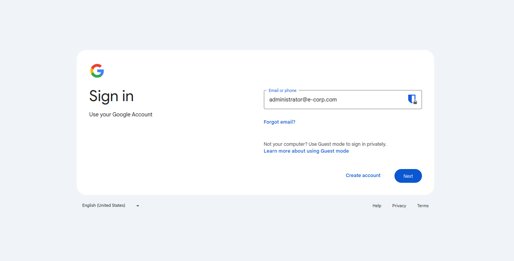

# Google Login Hijacking

## The project set up some docker containers:

Supposed to be used on a **self hosted hot-spot** in a network `192.168.10.0/24`.

### 1 - DNS

The first container is a DNS server using `bind9`, the server will resolve the domain `www.google.com` to the ip `192.168.10.1` (the Gateway).

### 2 - HTTPS

The https server is an `nginx` server, the steps to create a `self-signed` certificate and a key file are:

```bash
openssl genrsa -aes256 -passout pass:1234 -out server.pass.key 4096     # Generate the server pass key
openssl rsa -passin pass:1234 -in server.pass.key -out server.key       # Generate the server key from the server pass key

# Now the server.pass.key is no longer used

openssl req -new -key server.key -out server.csr                        # Createion of the csr file to create the cert
openssl x509 -req -sha256 -days 365 -in server.csr -signkey server.key -out server.crt # Creating the cert file
```

The file that will be used are:
- server.key
- server.crt

### 3 - HTTP

This container will display the login page, because of the self-signed certificate the browser will return a `MOZILLA_PKIX_ERROR_SELF_SIGNED_CERT` or `net::ERR_CERT_AUTHORITY_INVALID` or etc. (it depends on the browser), if the page does not display the `Proceed to` link you can type 'thisisunsafe' in a random place in the browser.

### How to use

After the configurations and the creations of the files in `./https-server/certs/server.key` and `./https-server/certs/server.crt`.


```bash
sudo docker-compose up -d
```

Now the victim just needs to login on fake page, after bypassing the unsafe connection page (you can use also the http protocol to not display the unsafe connection page).



The hijacker will log the email inserted.

```bash
cat logs/output.log 
[email]: 'administrator@e-corp.com'
```

Password insertion.


Then the hijacker will display a success access page (if you configured it).

```bash
cat logs/output.log 
[email]: 'administrator@e-corp.com'
[creds]: 'administrator@e-corp.com:Passw0rd123!'
```

And then we have the credentials.

## TIPS

If you want to change the login page you can change the login pages in `./fake-pages/src/`
Then if you want to add the domain you need to add a zone file in `./bind-dns/config/` a zone in `./bind-dns/config/named.conf` and change the domain in `./https-server/nignx/nginx.conf`.
